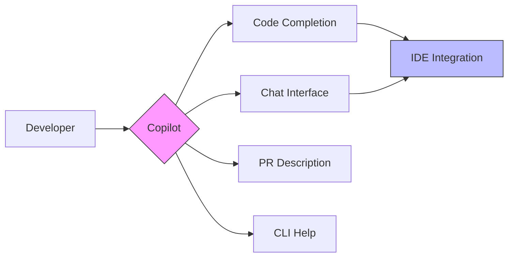
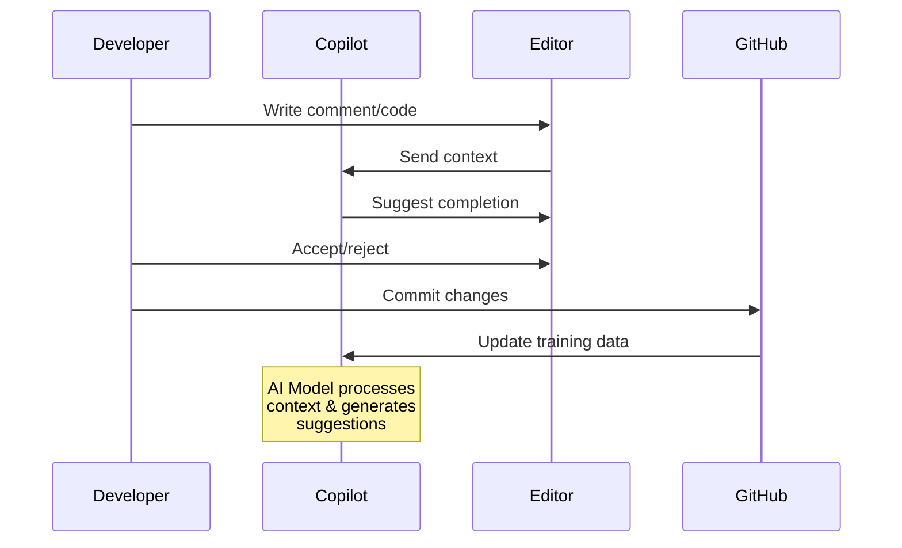

# GitHub Copilot

## Module Reference

- [GitHub Copilot Introduction](https://learn.microsoft.com/en-us/training/modules/introduction-to-github-copilot/)
- [GitHub Skills: Develop with AI-powered Code Suggestions](https://github.com/skills/copilot-codespaces-vscode)

## Study Guide Coverage

Domain 4: Modern Development

- [x] Describe GitHub Copilot
- [x] Describe the difference between GitHub Copilot for Individuals and GitHub Copilot for Business
- [x] Explain how to get started using GitHub Copilot

## Key Terminology

- OpenAI Codex: AI model powering GitHub Copilot
- Inline Suggestions: Real-time code completions
- Command Palette: Quick access to Copilot features
- Copilot Chat: Natural language interaction with AI
- CTRL+I/CMD+I: Shortcut for inline chat
- Comment-Driven Development: Using comments to generate code

## Core Concepts

### 1. Copilot Overview



- Purpose:
  • AI pair programming assistance
  • Code completion and generation
  • Natural language processing
- Impact:
  • 46% of new code AI-written
  • 55% faster development
  • 74% better developer focus

### 2. Key Features



- **Copilot for Chat:**
  • IDE-integrated ChatGPT interface
  • Context-aware code assistance
  • Bug fixing and code explanation
  
- **Copilot for Pull Requests:**
  • Automated PR descriptions
  • GPT-4 powered suggestions
  • Integration with [GitHub Flow](./02-introduction-github.md#github-flow)
  
- **Copilot for CLI:**
  • Command-line assistance
  • Command composition
  • Terminal workflow optimization

### 3. Subscription Plans

> See also: [GitHub Products](./03-github-products.md)

1. Individual Plans:
   - GitHub Copilot Free
   - GitHub Copilot Pro
2. Organization Plans:
   - GitHub Copilot Business
     • Team access management
     • Security vulnerability filtering
     • Public code filtering
     • IP indemnity
3. Enterprise Plans:
   - GitHub Copilot Enterprise
     • Private codebase indexing
     • Custom model fine-tuning
     • [Advanced security](./04-code-scanning.md) features

## Technical Implementation

```python
# Example of comment-driven development
# Function to calculate factorial recursively
def factorial(n):
    # Copilot generates implementation
    if n == 0:
        return 1
    return n * factorial(n-1)

# Generate unit tests for factorial function
def test_factorial():
    # Copilot suggests test cases
    assert factorial(0) == 1
    assert factorial(5) == 120
```

## Practice Exercises

1. Enable and Configure Copilot

   ```bash
   # Via VS Code:
   # 1. Install GitHub Copilot extension
   # 2. Sign in to GitHub
   # 3. Enable inline suggestions
   # 4. Test with simple function
   ```

2. Practice Comment-Driven Development

   ```python
   # Write a binary search function
   # Copilot will suggest implementation
   
   # Generate comprehensive tests
   # Copilot will create test cases
   
   # Add documentation
   # Copilot will suggest docstrings
   ```

## Study Questions

1. Q: What distinguishes Copilot Business from individual plans?
   A: Copilot Business adds team management, security filtering,
      IP indemnity, and enterprise security features.

2. Q: How does Copilot integrate with the development workflow?
   A: Through IDE extensions, PR automation, CLI assistance,
      and chat interfaces for natural language interaction.

## Additional Resources

- [Copilot Documentation](https://docs.github.com/copilot)
- [VS Code Integration Guide](https://docs.github.com/copilot/getting-started-with-github-copilot?tool=vscode)
- [Prompt Engineering Best Practices](https://github.blog/2023-06-20-how-to-write-better-prompts-for-github-copilot/)
