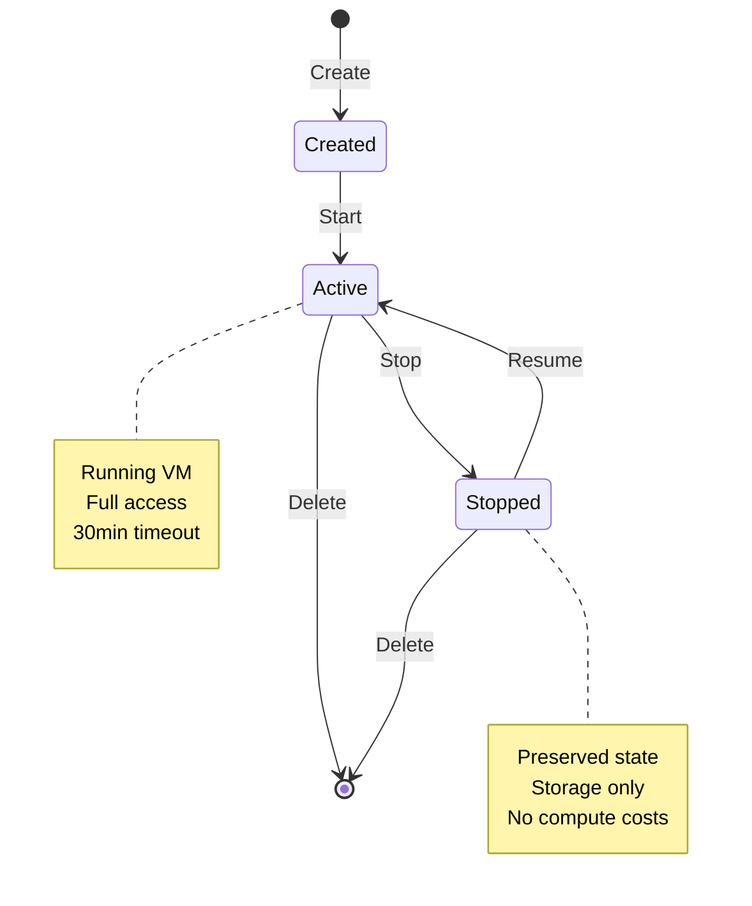
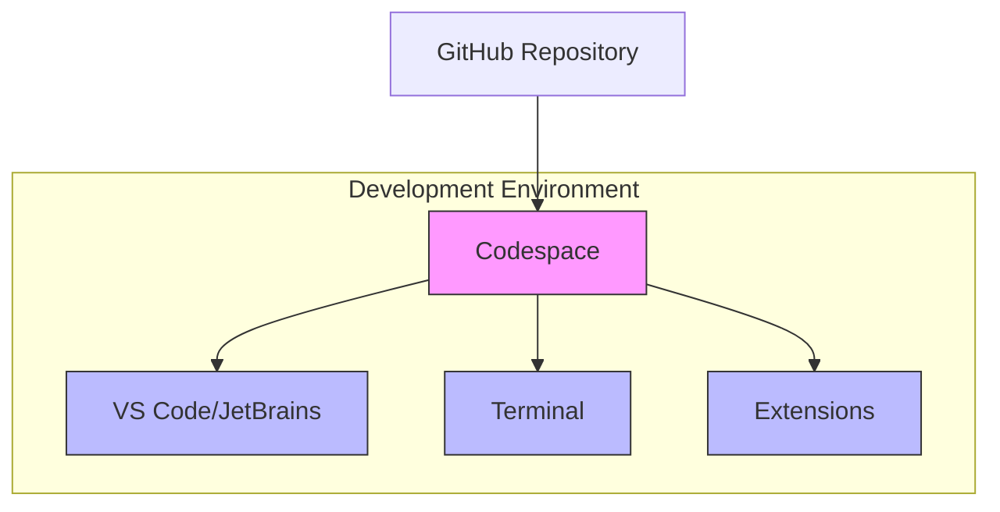

# GitHub Codespaces

## Module Reference

- [Introduction to GitHub Codespaces](https://learn.microsoft.com/en-us/training/modules/introduction-to-github-codespaces/)
- [GitHub Skills: Create a Codespace](https://github.com/skills/code-with-codespaces)

## Study Guide Coverage

Domain 4: Modern Development

- [x] Describe GitHub Codespaces
- [x] Identify how to start a GitHub codespace
- [x] Describe the codespace lifecycle
- [x] Describe the different customizations available
- [x] Explain how to use the github.dev editor

## Key Terminology

- Codespace: Cloud-based development environment
- Dev Container: Environment configuration file
- Settings Sync: VS Code settings synchronization
- Prebuilds: Pre-configured development environments
- Dotfiles: Personal environment settings

## Core Concepts

### 1. Codespace Lifecycle



- Creation Methods:
  • From repository/template
  • From branch
  • From pull request
  • From specific commit
  
- Environment States:
  • Active (running)
  • Inactive (stopped)
  • Deleted (removed)

### 2. Core Features



> See also: [GitHub Products](./03-github-products.md)

- Development Tools:
  • Full VM compute
  • Terminal access
  • [VS Code](./05-github-copilot.md#features) integration
  • [Copilot](./05-github-copilot.md) support

- Environment Features:
  • Persistence across sessions
  • Git integration
  • Extension support
  • Docker containers

### 3. Customization Options

> See also: [Security Features](./04-code-scanning.md)

1. Personal Settings:
   - VS Code Settings Sync
   - Dotfiles repository
   - Default editor choice
   - Regional preferences

2. Environment Config:
   - Machine type selection
   - Timeout settings
   - Storage management
   - Extension presets

## Technical Implementation

```yaml
# Example devcontainer.json
{
  "name": "Development Environment",
  "image": "mcr.microsoft.com/devcontainers/base:ubuntu",
  "features": {
    "ghcr.io/devcontainers/features/node:1": {},
    "ghcr.io/devcontainers/features/python:1": {}
  },
  "customizations": {
    "vscode": {
      "extensions": [
        "github.copilot",
        "github.vscode-pull-request-github"
      ]
    }
  }
}
```

## Practice Exercises

1. Basic Codespace Setup

    ```bash
    # 1. Create from repository
    # 2. Configure dev container
    # 3. Install extensions
    # 4. Test environment
    ```

2. Environment Customization

    ```bash
    # 1. Set up dotfiles
    # 2. Configure Settings Sync
    # 3. Add custom extensions
    # 4. Test persistence
    ```

## Study Questions

1. Q: What are key differences between Codespaces and github.dev?
   A: Codespaces provides full VM compute, terminal access, and
      extension support, while github.dev is for quick web-based
      edits without compute resources.

2. Q: How does codespace lifecycle management work?
   A: Codespaces can be created, stopped, resumed, and deleted.
      Changes persist in stopped state, and automatic deletion
      occurs after configured inactivity period.

## Additional Resources

- [Codespaces Documentation](https://docs.github.com/codespaces)
- [Dev Container Specification](https://containers.dev/)
- [VS Code Extension Guide](https://code.visualstudio.com/api/extension-guides/codespaces)
