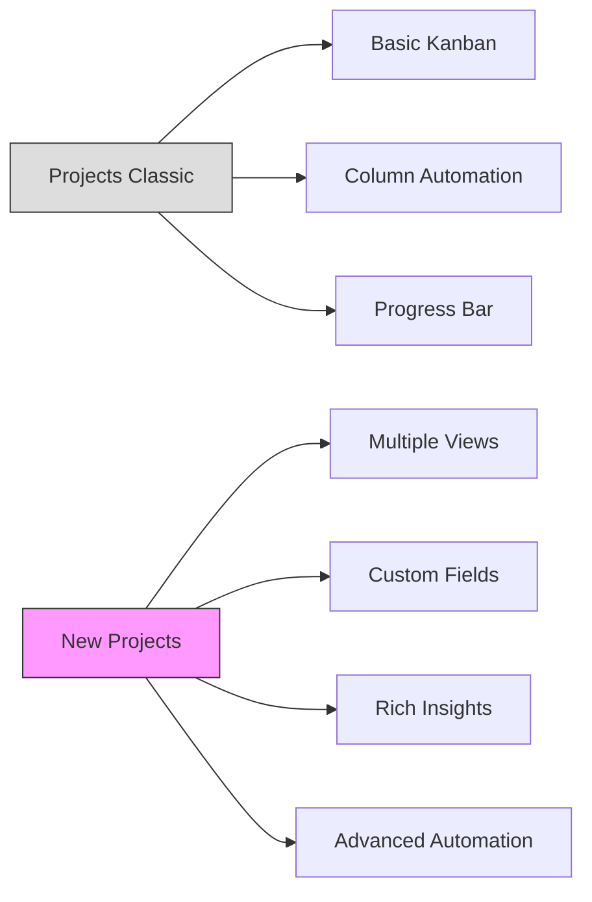
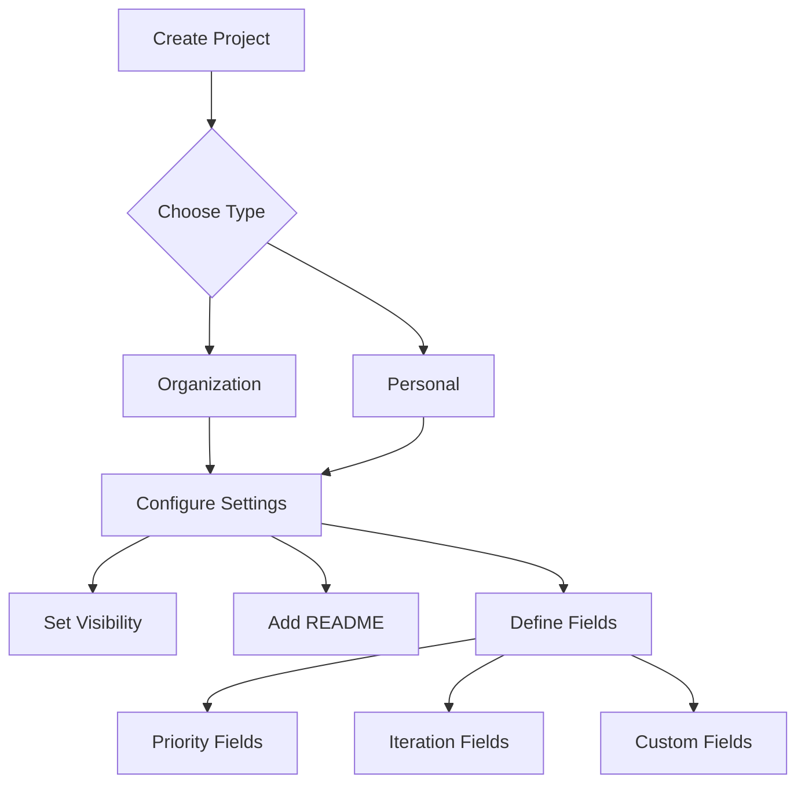
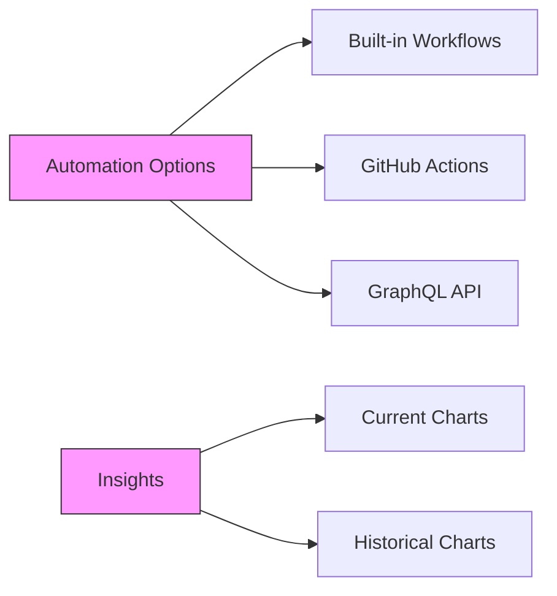

# GitHub Projects

## Module Reference

- [GitHub Projects](https://learn.microsoft.com/en-us/training/modules/github-projects/)
- [GitHub Skills: Organize with Project Boards](https://github.com/skills/organize-with-project-boards)

## Study Guide Coverage

Domain 5: Project Management

- [x] Describe GitHub Projects
- [x] Explain the layout options for projects
- [x] Describe the configuration options for projects
- [x] Explain the difference between projects and projects classic
- [x] Explain how to use project workflows
- [x] Describe project insights

## Key Terminology

- Project: Adaptable spreadsheet integrated with GitHub issues and PRs
- Views: Different layouts (table, board, timeline) of project data
- Fields: Custom data columns (text, number, date, iteration, single select)
- Iterations: Time-boxed phases for work organization
- Insights: Data visualization through charts and graphs

## Core Concepts

### 1. Projects vs Projects Classic



| Feature | Projects | Projects Classic |
|---------|----------|-----------------|
| Views | Tables, Boards, Timeline | Boards only |
| Data | Custom fields with sorting | Basic columns |
| Insights | Historical & current charts | Progress bar |
| Automation | GraphQL API, Actions | Column presets |

### 2. Project Setup & Configuration



1. Creation Process:
   - Organization/Personal selection
   - Template or scratch start
   - Name and description
   - README documentation

2. Field Configuration:
   - Priority tracking (Single select)
   - Iteration planning
   - Custom metadata fields

### 3. Views and Organization

1. Table View:
   - Spreadsheet-like interface
   - Custom field sorting
   - Bulk item management

2. Board View:
   - Kanban-style layout
   - Drag-and-drop organization
   - Status grouping

3. Timeline View:
   - Gantt-chart visualization
   - Date-based planning
   - Iteration tracking

### 4. Automation & Insights



1. Built-in Workflows:
   - Auto-add new items
   - Status updates
   - Field population

2. Chart Types:
   - Current state analysis
   - Historical trends
   - Custom visualizations

## Practice Exercises

1. Project Setup

   ```bash
   # 1. Create organization project
   # 2. Configure custom fields
   # 3. Set up iterations
   # 4. Create views
   ```

2. Workflow Automation

   ```bash
   # 1. Enable built-in workflows
   # 2. Configure status automation
   # 3. Test with new issues/PRs
   # 4. View automation results
   ```

## Study Questions

1. Q: What distinguishes Projects from Projects Classic?
   A: Projects offers multiple views (table, board, timeline),
      custom fields, rich insights, and advanced automation, while
      Classic only provides basic board views and column automation.

2. Q: What is the easiest way to add automation to Projects?
   A: Built-in workflows provide the simplest automation option,
      allowing automatic status updates and item addition without
      custom code.

3. Q: What field type enables priority grouping?
   A: The Single select field type allows creation of custom
      priority levels (High, Medium, Low) for grouping items.

4. Q: What section contains project visibility settings?
   A: The Danger zone section in project settings contains
      visibility controls along with close/delete options.

5. Q: What does an iteration field help track?
   A: Iteration fields create sequential phases for grouping
      work items, typically representing sprints or development
      cycles.

## Additional Resources

- [Projects Documentation](https://docs.github.com/en/issues/planning-and-tracking-with-projects)
- [Automating Projects](https://docs.github.com/en/issues/planning-and-tracking-with-projects/automating-your-project)
- [Project Views Guide](https://docs.github.com/en/issues/planning-and-tracking-with-projects/customizing-views-in-your-project)
