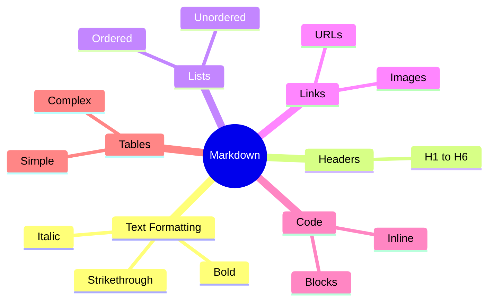

# GitHub Markdown Communication

## Module Reference

- [GitHub Markdown](https://learn.microsoft.com/en-us/training/modules/communicate-using-markdown/)
- [GitHub Skills: Communicate using Markdown](https://github.com/skills/communicate-using-markdown)

## Study Guide Coverage

Domain 1: Introduction to Git and GitHub

- [x] Identify the text formatting toolbar on issue and pull request comments
- [x] Describe Markdown
- [x] Identify the basic formatting syntax
- [x] Explain where to find and use slash commands

## Key Terminology

- Markdown: Lightweight markup language for formatting text
- GFM: GitHub Flavored Markdown, GitHub's Markdown dialect
- Slash Commands: Quick formatting shortcuts in GitHub
- Syntax Highlighting: Language-specific code coloring
- Task Lists: Checkable todo items

## Core Concepts

### 1. Basic Syntax



#### Text Styling

```markdown
*Italic*              _Italic_
**Bold**             __Bold__
***Bold Italic***    ___Bold Italic___
~~Strikethrough~~
```

#### Headers & Lists

```markdown
# H1  ## H2  ### H3  #### H4  ##### H5  ###### H6

1. Ordered
2. List
   - Nested
   - Items
```

### 2. GitHub-Specific Features

```mermaid
graph TD
    A[GitHub Markdown] --> B[Task Lists]
    A --> C[References]
    A --> D[Slash Commands]
    A --> E[Emoji]
    
    B --> F[- [ ] Todo]
    B --> G[- [x] Done]
    
    C --> H[@mentions]
    C --> I[#issues]
    C --> J[Commits]
    
    D --> K[/code]
    D --> L[/table]
    D --> M[/details]
    
    style A fill:#f9f,stroke:#333
```

#### Slash Commands

| Command | Purpose |
|---------|----------|
| /code | Insert code block |
| /details | Add collapsible section |
| /table | Create formatted table |
| /tasklist | Insert task list |
| /template | Use repository template |
| /saved-replies | Insert saved response |

### 3. Advanced Features

1. Code Blocks:

    ```markdown
        ```python
        def hello():
            print("Hello World")
        ```
    ```

2. Tables:

    ```markdown
    | Header | Align Left | Align Center | Align Right |
    |--------|:-----------|:------------:|------------:|
    | Cell   | Cell       |    Cell      |       Cell |
    ```

3. References:

    ```markdown
    @username
    #issue-number
    organization/repository#issue
    commit-sha
    ```

## Practice Exercises

1. Basic Formatting

    ```markdown
        # Exercise Title

        **Bold text** and *italic text*

        1. First item
        2. Second item
        - Subitem
        - Another subitem

        > Quote block
    ```

2. Advanced Features

    ```markdown
        ### Task List
        - [x] Create repository
        - [ ] Add README
        - [ ] Configure project

        ### Code Sample
        ```python
        def example():
            return "Hello"
        ```

        ### Table

        | Name | Role |
        |------|------|
        | User | Admin |
    ```

## Study Questions

1. Q: How do you create bold italic text in Markdown?
   A: Use three asterisks or underscores: ***text*** or \_\_\_text\_\_\_

2. Q: How do you escape special characters in Markdown?
   A: Use a backslash (\) before the character: \* \_ \#

3. Q: Can you mix HTML with Markdown?
   A: Yes, inline HTML can be used when Markdown lacks the
      needed functionality.

## Additional Resources

- [GitHub Markdown Guide](https://docs.github.com/en/get-started/writing-on-github)
- [GFM Specification](https://github.github.com/gfm/)
- [Markdown Cheatsheet](https://www.markdownguide.org/cheat-sheet/)
