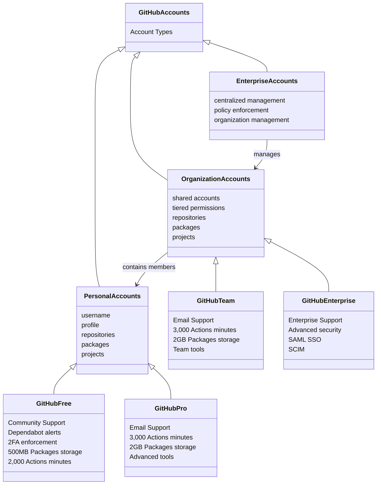
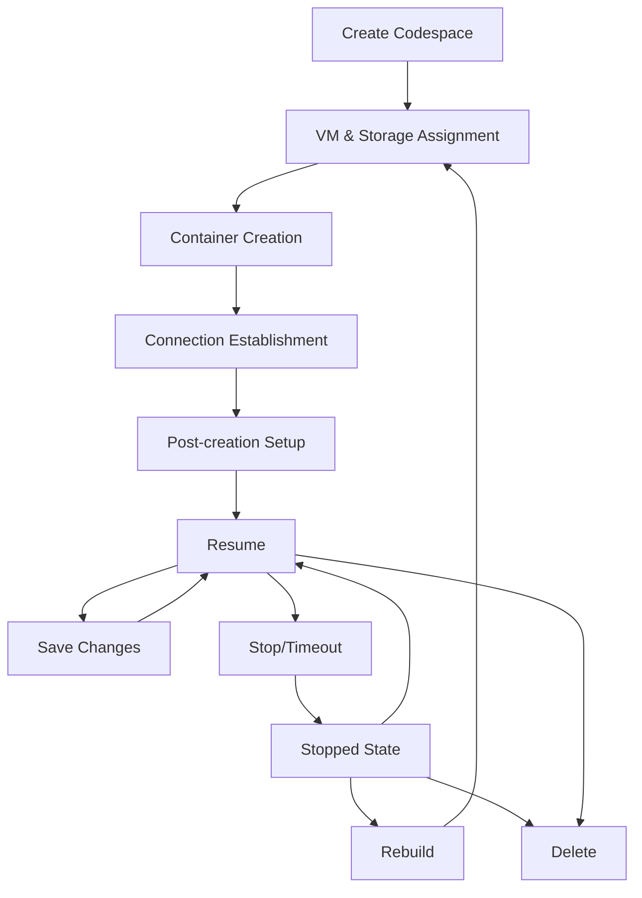
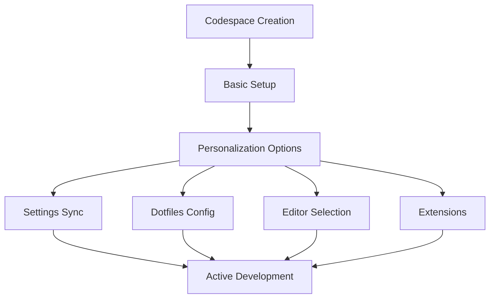
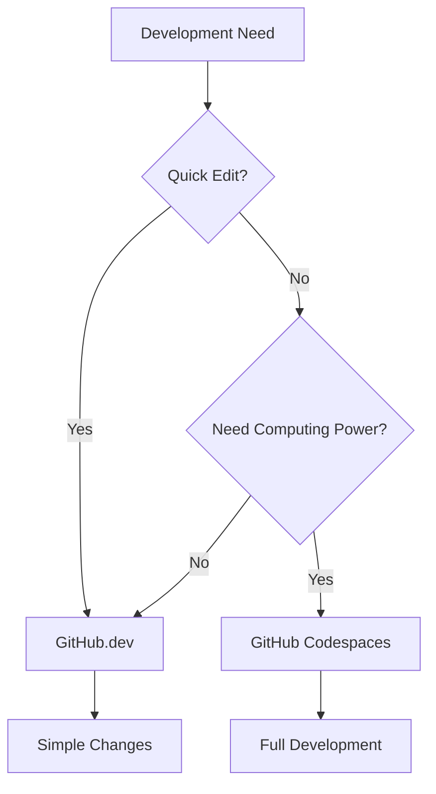

# GitHub Foundations Certification Study Guide

## Table of Contents
1. [Git and GitHub Fundamentals](#git-and-github-fundamentals)
   - Git Version Control Basics
   - GitHub Platform Overview
   - GitHub Flow Components
   - Communication & Collaboration Tools

2. [GitHub Products and Features](#github-products-and-features)
   - Account Types and Hierarchy
   - Plans and Features
   - GitHub Mobile and Desktop
   - GitHub Billing

3. [Security and Code Quality](#security-and-code-quality)
   - Code Scanning Configuration
   - Security Best Practices
   - CodeQL Implementation
   - Lab Exercises

4. [GitHub Copilot](#github-copilot)
   - Overview and Features
   - Subscription Options
   - Setup and Configuration
   - Best Practices

5. [GitHub Development Environment](#github-development-environment)
   - Codespaces Lifecycle
   - GitHub.dev vs Codespaces
   - Personalization Options
   - Environment Management

6. [Project Management](#project-management)
   - Projects vs Projects Classic
   - Project Creation and Setup
   - Organization and Visibility
   - Insights and Automation

7. [Markdown and Documentation](#markdown-and-documentation)
   - Basic Formatting
   - GitHub-Flavored Markdown
   - Best Practices

8. [Open Source Contribution](#open-source-contribution)
   - Getting Started
   - Making Contributions
   - Pull Request Best Practices
   - Community Engagement

9. [Administration and Security](#administration-and-security)
   - Repository Security
   - User Authentication
   - Authorization Management
   - Team Synchronization

[Detailed Content Below]

# Git and GitHub Fundamentals

## Git Version Control Basics

### What is Version Control?

Version Control System (VCS) is a set of tools that tracks changes in files and enables:

- Version history tracking and retrieval
- Collaborative work without interference
- Change documentation and messaging
- Branch creation for experimental features
- Version tagging (e.g., for releases)

## GitHub Platform Overview

Git is an open-source, distributed VCS created by Linus Torvalds that offers:

- Fast and scalable performance
- Local and server-side repository copies
- Offline work capability
- Robust backup system

## Key Git Terminology

- Working Tree & Repository
    
    • Working Tree: Project's directory structure with files
    • Repository (repo): Directory containing project history and metadata
    
- Core Concepts
    
    • Hash: Digital fingerprint of file contents
    • Objects: Blobs (files), Trees (directories), Commits (versions), Tags (named points)
    • Branch: Named series of commits
    • Remote: Reference to external Git repository
    

## Git vs GitHub

While Git is the version control system, GitHub is a cloud platform that:

- Hosts Git repositories
- Provides collaboration tools (Issues, Pull requests)
- Offers project management features
- Enables team discussions and notifications
- Includes automation through GitHub Actions

<aside>
💡 Note: While GUI tools exist for Git, command-line proficiency is recommended for full functionality and troubleshooting capability.

</aside>

---

# Introduction to GitHub

## Basic Git Commands

- git status
    
    • Shows the current state of working tree and staging area
    • Displays which changes are being tracked
    • Most commonly used command for checking repository status
    
- git add
    
    • Begins tracking changes in specified files
    • Stages changes for commit
    • Moves files to staging area before committing
    
- git commit
    
    • Creates a snapshot of staged changes
    • Each commit includes:
      - Author information
      - Timestamp
      - Commit message
      - Changes made
      - Reference to previous commit
    
- git log
    
    • Displays information about previous commits
    • Shows:
      - Commit timestamps
      - Author details
      - Commit messages
    • Helps track change history
    
- git help
    
    • Access documentation for Git commands
    • Use git <command> --help for specific command help
    • Essential for learning and troubleshooting
    

<aside>
💻 Pro Tip: Start with these basic commands to build a strong foundation in Git. Regular practice with these commands will help develop comfort with version control concepts.

</aside>

## Core Concepts Overview

### 1. GitHub Enterprise Platform

- **AI Integration:**
    - Copilot for enhanced productivity
    - AI-powered pull requests and issues
    - Automated security checks
- **Collaboration Features:**
    - Repositories
    - Issues tracking
    - Pull request system
    - Seamless team workflow tools
- **Productivity Tools:**
    - Built-in CI/CD integration
    - Automated task management
    - Streamlined administrative processes

### 2. Security Framework

- **Key Security Features:**
    - Native first-party security
    - Private code protection
    - Security overview functionality
    - Dependabot integration
- **Enterprise Compliance:**
    - Global compliance standards
    - Trusted by Microsoft
    - Suitable for regulated industries

### 3. Platform Scale

- **Community Statistics:**
    - 100M+ developers
    - 330M+ repositories
    - Global deployment network

### 4. Repository Fundamentals

- **Repository Creation:**
    - Account-based ownership
    - Public/private visibility options
    - File management system
    - Version control capabilities

### 5. Additional Tools

- **Gists:**
    - Code snippet sharing
    - Public/secret options
    - Git repository functionality
- **Wikis:**
    - Project documentation
    - Access control
    - Collaborative editing

<aside>
💡 **Exam Tips:**
- Focus on understanding the five core pillars: AI, Collaboration, Productivity, Security, and Scale
- Know the difference between public and private repositories
- Understand the basic workflow of creating and managing repositories
- Be familiar with supplementary tools like gists and wikis

</aside>

---

## GitHub Flow Components Study Guide

### 1. Branches

- **Definition:** Safe environments for experimenting with changes without affecting main project
- **Key Features:**
    - Allows isolated development work
    - Supports experimentation with rollback capability
    - Changes remain separate until merge
    - Can be created via GUI or git checkout -b command

### 2. Commits

- **Definition:** Tracked changes to files with unique IDs and audit trails
- **File States:**
    - Untracked: New files not in Git's system
    - Tracked - Unmodified: Files without changes
    - Tracked - Modified: Changed but not staged
    - Tracked - Staged: Changes ready for commit
    - Tracked - Committed: Changes saved in repository

### 3. Pull Requests

- **Definition:** Mechanism to propose branch merges
- **Key Components:**
    - Review process
    - Collaboration opportunity
    - Change verification
    - Discussion platform

### 4. GitHub Flow Process

- **Step-by-Step Workflow:**
    - 1. Create branch
    - 2. Make changes
    - 3. Create pull request
    - 4. Review and iterate
    - 5. Merge approved changes
    - 6. Delete completed branch

<aside>
💡 **Key Exam Focus Areas:**
- Understanding branch isolation and protection
- Commit state transitions and management
- Pull request workflow and collaboration
- GitHub Flow process sequence and best practices

</aside>

---

## GitHub Communication & Collaboration Tools

### 1. Issues

- **Purpose:** Track ideas, feedback, tasks, and bugs
- **Creation Methods:**
    - From repository directly
    - Task list items
    - Project notes
    - Issue/PR comments
    - Specific code lines
    - URL queries

### 2. Issue Creation Process

- **Steps:**
    - Navigate to repository
    - Select Issues tab
    - Click New Issue
    - Choose template or blank issue
    - Add title and description
    - Configure optional settings (assignments, labels, etc.)
    - Submit new issue

### 3. Discussions

- **Purpose:** Public forum conversations not directly related to code
- **Key Features:**
    - Repository-inherited visibility
    - Customizable categories
    - Community-wide accessibility

### 4. Discussion Categories

| **Category** | **Purpose** | **Format** |
| --- | --- | --- |
| 📣 Announcements | Project updates and news | Announcement |
| #️⃣ General | General project discussions | Open-ended |
| 💡 Ideas | Improvement suggestions | Open-ended |
| 🗳️ Polls | Community voting | Poll-based |
| 🙏 Q&A | Community questions | Q&A format |
| 🙌 Show and tell | Project demonstrations | Open-ended |

<aside>
💡 **Exam Tips:**
- Understand the difference between Issues and Discussions
- Know how to create and manage Issues through different methods
- Be familiar with Discussion categories and their purposes
- Remember the steps for enabling and configuring Discussions

</aside>

---

## GitHub Platform Management & Pages

### 1. Notification Management

- **Definition:** Updates received for specific GitHub activities you're subscribed to
- **Subscription Types:**
    - Issue, pull request, and gist conversations
    - CI activity and workflow status
    - Repository-wide activities
    - Security alerts and discussions
- **Automatic Subscriptions:**
    - Opening pull requests or issues
    - Commenting on threads
    - Being assigned to tasks

### 2. Finding Relevant Issues

- **Search Functionality:**
    - Use `mentions:` qualifier to find specific user mentions
    - Customize notification preferences

### 3. GitHub Pages Overview

- **Purpose:** Host and publish websites directly from GitHub repositories
- **Key Features:**
    - Static site hosting service
    - Supports HTML, CSS, and JavaScript
    - Optional build process available
    - Real-time updates with repository changes

<aside>
💡 **Exam Tips:**
- Understand notification types and subscription management
- Know how to use search qualifiers effectively
- Be familiar with GitHub Pages capabilities and limitations
- Remember the basic workflow for creating and managing pages

</aside>

---

# GitHub Products and Features

## GitHub Account Types and Hierarchy

GitHub provides three main account types, each designed to meet different needs and organizational levels:

- **Personal Accounts**
    - These accounts represent individual users on GitHub.
    - Key features include:
        - Identity with username and profile.
        - Ability to own repositories, packages, and projects.
        - Actions attributed to the personal account.
        - Plans available: GitHub Free and GitHub Pro.
- **Organization Accounts**
    - Shared accounts for team collaboration.
    - Key features include:
        - Tiered permission system for managing teams.
        - Repositories, packages, and projects owned collectively.
        - Members sign in using their personal accounts.
        - Plans available: GitHub Free (Organizations) and GitHub Team.
- **Enterprise Accounts**
    - Designed for centralized management of multiple organizations.
    - Key features include:
        - Centralized policies and billing management.
        - Support for inner sourcing between organizations.
        - Enterprise owners can enforce policies across all organizations.
        - Plans available: GitHub Enterprise Server and GitHub Enterprise Cloud.

## Plans and Features Breakdown

Each account type can choose from different plans, offering specific features and capabilities:

- **GitHub Free (Personal)**
    - Community Support.
    - Dependabot alerts and two-factor authentication enforcement.
    - 500-MB Packages storage.
    - 2,000 Actions minutes per month.
- **GitHub Pro (Personal)**
    - Includes all GitHub Free features.
    - Email support and advanced tools for private repositories.
    - 3,000 Actions minutes and 2-GB Packages storage per month.
- **GitHub Team (Organizations)**
    - Includes all GitHub Free (Organizations) features.
    - Email support and advanced repository features specific to teams.
    - 3,000 Actions minutes and 2-GB Packages storage per month.
- **GitHub Enterprise**
    - Includes all GitHub Team features.
    - Enterprise support, advanced security, and compliance options.
    - SAML SSO and SCIM support for provisioning access.
    - Options for self-hosted (Enterprise Server) or cloud-based (Enterprise Cloud) solutions.

## Visualizing the Hierarchy



## GitHub Mobile and GitHub Desktop

There are multiple ways to access your GitHub account aside from [github.com](http://github.com). GitHub Mobile and GitHub Desktop allow you to have a seamless experience while accessing your account on the go.

### GitHub Mobile

- Manage, triage, and clear notifications from [github.com](http://github.com).
- Read, review, and collaborate on issues and pull requests.
- Edit files in pull requests.
- Search for, browse, and interact with users, repositories, and organizations.
- Receive a push notification when someone mentions your username.
- Schedule your push notifications for specific custom hours.
- Secure your [GitHub.com](http://GitHub.com) account with two-factor authentication.
- Verify your sign in attempts on unrecognized devices.

### GitHub Desktop

- Add and clone repositories.
- Add changes to your commit interactively.
- Quickly add coauthors to your commit.
- Check out branches with pull requests and view CI statuses.
- Compare changed images.

## GitHub Billing

GitHub bills separately for each account. You receive a separate bill for your personal account and for each organization or enterprise account you own.

The bill for each account is a combination of charges for your subscriptions and usage-based billing.

- **Subscriptions:** Include your account's plan, such as GitHub Pro or GitHub Team, and paid products that have a consistent monthly cost, such as GitHub Copilot and apps from GitHub Marketplace.
- **Usage-based billing:** Applies when the cost of a paid product depends on how much you use the product. For example, the cost of GitHub Actions depends on how many minutes your jobs spend running and how much storage your artifacts use.

---

# Security and Code Quality

## Configure code scanning on GitHub

### What is Code Scanning?

Code scanning is a security feature that uses CodeQL to analyze GitHub repositories for vulnerabilities and coding errors. Its advanced analysis capabilities include:

- Security vulnerabilities (SQL injection, XSS attacks, authentication issues)
- Coding errors (memory leaks, null pointer exceptions)
- Available for all public repositories and private repositories with GitHub Advanced Security license

### Key Features

- Real-time alerts in repository's Security tab with detailed vulnerability information
- Automated vulnerability detection using CodeQL's semantic analysis
- Scheduled or event-triggered scans (configurable for push, pull request, or cron events)
- Prevention of new code problems through pre-merge checks

### CodeQL Overview

CodeQL is GitHub's code analysis engine that:

- Treats code as data for analysis using semantic understanding
- Generates a queryable database representing the entire codebase structure
- Runs complex security queries to identify potential vulnerabilities and anti-patterns

### Supported Languages

- C/C++ (including preprocessor directives and macros)
- C# (.NET Framework and .NET Core)
- Go (including Go modules)
- Java/Kotlin (Android and enterprise applications)
- JavaScript/TypeScript (Node.js and browser-based)
- Python (2.7 and 3.x versions)
- Ruby (Rails and standalone applications)
- Swift (iOS and macOS applications)

### Setup Options

Three main ways to implement CodeQL analysis, each with specific use cases:

- **Default Setup:** Quick configuration with automated language detection and query selection, ideal for standard projects
- **Advanced Setup:** Customizable workflow file using github/codeql-action, recommended for complex scanning requirements
- **External CI System:** Direct CLI implementation with result uploads to GitHub, suitable for custom CI/CD pipelines

### Implementation Steps

1. Navigate to repository's main page (ensure proper access permissions)
2. Select Security tab (requires GitHub Advanced Security enabled)
3. Click "Set up code scanning" (must have write permissions)
4. Choose Default setup (recommended for initial configuration)
5. Review and customize options if needed (languages, schedule, triggers)
6. Enable CodeQL (initiates first analysis scan)

### Important Notes

- Triggers on pull requests and pushes to protected branches (configurable via workflow)
- Affects monthly billing minutes for GitHub Actions (consider usage limits)
- Free for public repositories and self-hosted runners (unlimited scans)
- Usage limits apply for private repositories based on account type (Enterprise vs Team)

### Implementing Third-Party Code Scanning

#### SARIF File Integration - Core Requirements

- **SARIF Version Requirements:** MANDATORY use of SARIF version 2.1.0 - older versions not supported
- **Upload Methods:**
    - Code-scanning API (REST-based)
    - CodeQL CLI (command-line tool)
    - GitHub Actions (workflow automation)
- **Critical Limitations:**
    - File Size: Strict 10MB limit for gzip-compressed SARIF files - larger files rejected
    - Results Cap: Hard limit of 5000 results per upload - excess results discarded

#### Upload Methods - Detailed Comparison

- **1. Code-scanning API (REST)**
    
    - Primary endpoint: api.github.com (HTTPS required)
    - Media type specification: application/sarif+json (mandatory)
    - Authentication: Bearer token required
    - Key capability: Programmatic upload and result processing
    
- **2. CodeQL CLI (Command Line)**
    
    - Primary function: Local code analysis and database generation
    - Licensing: Free for public repos only
    - Distribution method: CodeQL bundle (includes queries + libraries)
    - Key requirement: Must use official bundle for compatibility
    
- **3. GitHub Actions (CI/CD)**
    
    - Configuration: .github/workflows directory required
    - Key action: github/codeql-action/upload-sarif@v1
    - Trigger options: push, pull_request, schedule
    - Authentication: Automatic via GITHUB_TOKEN
    

#### Implementation Best Practices

- Continuous Integration: Configure automated upload workflows with specific triggers
- Deduplication: Implement partialFingerprints for accurate alert tracking
- Resource Management: Prioritize critical rules when approaching limits
- Scheduling Strategy: Combine push-triggered and scheduled analyses for coverage

## Code Scanning Configuration

### 1. Core Components

- **Definition & Purpose:**
    - Security analysis engine utilizing CodeQL for comprehensive code analysis
    - Real-time vulnerability detection system with continuous monitoring
    - Integration with repository workflows for automated security checks
- **Licensing Structure:**
    - Free tier: Unlimited scans for public repositories
    - Advanced Security license required for private repositories
    - Team/Enterprise plans have different scanning quotas and features

### 2. Scanning Triggers

- **Push-Based Scanning:**
    - Automatic scanning on default branch commits
    - Protected branch scanning with customizable rules
    - Pull request integration with automated alerts
- **Pull Request Analysis:**
    - Differential analysis between merge and head commits
    - Security checks for forked repository PRs
    - Configurable failure thresholds based on severity
- **Scheduled Scans:**
    - Customizable cron expressions for periodic scans
    - Automated scheduling with load balancing
    - Best practices for scan timing and frequency

### 3. Technical Framework

- **Analysis Architecture:**
    - Code representation as queryable data structures
    - Multi-stage analysis pipeline with detailed reporting
    - Comprehensive build and compilation integration
- **Supported Languages:**
    - Compiled languages: C/C++, C#, Go, Java/Kotlin, Swift
    - Interpreted languages: JavaScript/TypeScript, Python, Ruby
    - Language-specific analysis patterns and rules

### 4. Implementation Methods

- **Default Configuration**
    
    • Language detection with automated setup
    • Standard security query packages
    • Built-in configuration parameters
    
- **Advanced Configuration**
    
    • Custom workflow files in .github/workflows
    • Detailed GitHub Actions configuration
    • Extensive query customization options
    
- **CI/CD Integration**
    
    • Command-line interface usage
    • SARIF reporting framework
    • Enterprise CI system compatibility
    

### 5. Setup Process

1. **Access Configuration:** Security settings navigation and permissions
2. **Setup Options:** Configuration method selection criteria
3. **Parameter Configuration:** Complete setup requirements
4. **Validation:** System verification and testing

### 6. Advanced Settings

- **Security Controls:**
    - Branch protection rules and enforcement
    - Custom security query implementation
    - Alert severity threshold management
- **Resource Controls:**
    - Compute resource allocation
    - Storage optimization strategies
    - System performance tuning

<aside>
💡 **Key Points:**
• Scan trigger configuration and timing
• Custom workflow implementation
• Security alert management
• Scheduled scan optimization
• System troubleshooting
• Query development
• Access control managements

</aside>

## Lab Exercise Steps Overview

### Step 1: Enable CodeQL

- **Initial Setup:**
    - Navigate to Settings → Security → Code security and analysis
    - Enable CodeQL with Default configuration
    - Configure for Python language analysis

### Step 2: Review and Triage Alerts

- **Alert Management:**
    - View scan results in Actions tab
    - Access Security → Code scanning for findings
    - Learn to dismiss alerts and create GitHub issues

### Step 3: Fix Security Vulnerabilities

- **Remediation Process:**
    - Identify vulnerable SQL queries in routes.py
    - Implement secure SQL parameterization
    - Verify fixes through new CodeQL scan

### Step 4: Pull Request Integration

- **Testing PR Workflow:**
    - Create branch with intentionally vulnerable code
    - Submit pull request to trigger CodeQL analysis
    - Review automated security findings in PR

<aside>
🔑 **Key Concepts Covered:**
• GitHub Actions for security scanning
• CodeQL static analysis functionality
• Pull request security integration
• SQL injection vulnerability detection
• Security alert triage process

</aside>

### Important Terms

- **CodeQL**
    
    Static analysis tool for identifying security weaknesses like SQL injection and cross-site scripting
    
- **GitHub Actions**
    
    CI/CD platform used to automate security scans and code analysis workflows
    
- **CWE (Common Weakness Enumeration)**
    
    Standardized system for categorizing software security weaknesses and vulnerabilities

---

# GitHub Copilot

## Overview of GitHub Copilot

### What is GitHub Copilot?

An AI-powered pair programmer developed by Microsoft and OpenAI, using OpenAI Codex system for code generation.

### Key Statistics & Benefits

- 46% of new code is now written by AI
- 55% faster overall developer productivity
- 74% of developers report better focus on satisfying work

### Major Features

- **Copilot for Chat:** ChatGPT-like interface integrated with IDEs for code analysis, bug fixes, and unit test generation
- **Copilot for Pull Requests:** Automated PR descriptions using GPT-4
- **Copilot for CLI:** Command-line assistance for complex commands and syntax
- Available for VS Code, Visual Studio, Vim/Neovim, and the JetBrains

### Subscription Options

Available in four tiers:

- GitHub Copilot Free (Personal accounts)
- GitHub Copilot Pro (Personal accounts)
- GitHub Copilot Business (Organization accounts)
- GitHub Copilot Enterprise (Enterprise accounts)

### Business Features

- Code completions and chat in IDE
- Security vulnerability filtering
- Code referencing
- Public code filtering
- IP indemnity
- Enterprise-grade security

### Enterprise-Specific Features

- Codebase indexing for personalized suggestions
- Private model fine-tuning
- Integrated chat interface
- Documentation building and searching
- Enhanced pull request review capabilities

<aside>
💡 **Exam Tips:** Focus on understanding the different subscription tiers, key features of each level, and the statistical benefits of using GitHub Copilot. Pay special attention to the distinction between Business and Enterprise features.

</aside>

## Ways to Interact with Copilot

### 1. Inline Suggestions

- **Auto-complete feature:** Shows grayed-out text predictions as you type
- **Key controls:**
    - Accept suggestion: Tab or Right arrow key
    - Reject suggestion: Esc key or keep typing

### 2. Command Palette Access

- **Activation:** Ctrl+Shift+P (Windows/Linux) or Cmd+Shift+P (Mac)
- **Features:** Quick access to functions like Explain This and Generate Unit Tests

### 3. Chat Interfaces

- **Copilot Chat:** Natural language interaction for code assistance and queries
- **Inline Chat:** Context-specific help (Ctrl+I or Cmd+I)

### 4. Comment-Driven Development

- **Natural language processing:** Converts comments into functional code
- **Usage:** Write descriptive comments and press Enter for suggestions

### 5. Advanced Features

- **Multiple suggestions:** Cycle through alternatives using Alt+] or Option+]
- **Code explanations:** Select code and use "Explain This" feature
- **Automated testing:** Generate unit tests for functions and classes

<aside>
💡 **Key Exam Points:** 
- Remember keyboard shortcuts for different features
- Understand the different interaction methods
- Know how to access and use each feature effectively
- Focus on the practical applications of each interaction type

</aside>

## GitHub Copilot Setup and Configuration Guide

### 1. Initial Setup Process

- **Step-by-step account setup:**
    - Access GitHub profile settings
    - Navigate to "Code, planning, and automation"
    - Select Copilot and choose subscription

### 2. VS Code Integration

- **Installation steps:**
    - Install from Visual Studio Marketplace
    - Open VS Code and authorize GitHub account
    - Verify installation through extension tab

### 3. Configuration Options

- **Global vs Language-specific settings:**
    - Toggle Copilot globally or per language
    - Manage inline suggestions
    - Customize autocompletion behavior

### 4. Troubleshooting Guide

- **Common troubleshooting methods:**
    - Access logs via "Developer: Open Log File"
    - Check Extension Logs Folder
    - Use "Toggle Developer Tools" for detailed debugging
- **Network-related issues:**
    - Check firewall settings
    - Verify proxy configuration
    - Run diagnostics using Command Palette

<aside>
💡 **Exam Focus Points:**
- Remember the exact steps for installation and configuration
- Know how to access different log locations
- Understand the difference between global and language-specific settings
- Be familiar with keyboard shortcuts for diagnostics (Shift+Command+P for Mac, Ctrl+Shift+P for Windows/Linux)

</aside>

### 5. Quick Reference: Keyboard Shortcuts

```
Mac:
- Open Command Palette: Shift+Command+P
- Collect Diagnostics: Command Palette → "GitHub Copilot: Collect Diagnostics"

Windows/Linux:
- Open Command Palette: Ctrl+Shift+P
- Collect Diagnostics: Command Palette → "GitHub Copilot: Collect Diagnostics"
```

## Hands-On Exercise: GitHub Copilot with VS Code

### Step 1: Setting Up Copilot in Codespaces

This exercise demonstrates how to leverage GitHub Codespaces with VS Code for Copilot integration.

<aside>
💡 **Prerequisites:** Complete the GitHub Codespaces skill exercise before starting this tutorial.

</aside>

- **Initial Setup:**
    - Create a .devcontainer/devcontainer.json file
    - Configure VS Code extensions including GitHub Copilot
    - Launch a new Codespace environment

### Step 2: Creating AI-Assisted Code

- **Basic JavaScript Implementation:**
    - Create and edit JavaScript files
    - Use Copilot's auto-suggestions
    - Accept or modify AI-generated code

### Step 3: Advanced Copilot Features

- **Multiple Suggestions Panel:**
    - Access the completions panel
    - Compare different AI-generated solutions
    - Select and implement preferred code options

### Step 4: Comment-Driven Development

- **Using Comments for Code Generation:**
    - Write descriptive comments
    - Generate server-side code automatically
    - Manage and version control generated code

<aside>
💡 **Exercise Tips:**
- Keep a separate browser tab open for reference
- Pay attention to Git commands for version control
- Experiment with different comment styles to see how they affect Copilot's suggestions
- Use keyboard shortcuts to improve efficiency

</aside>

---

# GitHub Development Environment

## GitHub Codespaces Lifecycle Overview

### 1. Creating a Codespace

- **Four creation methods:**
    - From GitHub template/repository
    - From a branch
    - From a pull request
    - From a specific commit



### 2. Working in a Codespace

- **Key Features:**
    - AutoSave enabled by default in web browser
    - Changes saved to cloud VM
    - Internet connection required
    - 30-minute default inactivity timeout

### 3. Managing Your Codespace

| **Action** | **Important Notes** |
| --- | --- |
| Save Changes | Commit and push to repository |
| Timeout | 30 minutes of inactivity |
| Stop/Close | Preserves uncommitted changes |
| Rebuild | Preserves /workspaces content only |

### 4. Best Practices

- **Regular commits:** Especially with unstable internet
- **Push changes frequently:** Prevents work loss
- **Pull updates:** Keep long-running Codespaces current
- **Monitor storage:** Delete unused Codespaces

<aside>
💡 **Pro Tip:** Inactive Codespaces are automatically deleted after 30 days, but you can customize retention periods based on your needs.

</aside>

### 5. Cost Considerations

- **Running Codespaces:** Incur CPU charges
- **Stopped Codespaces:** Only storage costs apply
- [ ]  Remember to commit changes before closing Codespace
- [ ]  Check for any unpushed commits before deletion
- [ ]  Review and customize timeout settings if needed

## Personalizing Your GitHub Codespace

### Key Customization Options

| **Feature** | **Description** | **Example/Usage** |
| --- | --- | --- |
| Settings Sync | Syncs VS Code settings across devices | Theme preferences, keyboard shortcuts, extensions |
| Dotfiles | Repository for configuration files | .bashrc, .gitconfig, shell scripts |
| Machine Type | Customize computing resources | 2-core, 4-core, 8-core options |
| Default Editor | Choose preferred development environment | VS Code, JetBrains, JupyterLab |

### Environment Settings

- **Shell Customization:**
    - Change default shell (bash, zsh, etc.)
    - Configure via dotfiles
    - Open new terminals with preferred shell
- **Timeout Configuration:**
    - Default: 30 minutes of inactivity
    - Customizable in personal settings
    - Applies to new and resumed Codespaces

### Extension Support

<aside>
💡 **VS Code Extensions**
Available through Visual Studio Code Marketplace
Settings Sync enables automatic extension syncing across devices

</aside>

<aside>
🔧 **JetBrains Plugins**
Access to full JetBrains Marketplace
Customize IDE functionality as needed

</aside>



### Best Practices Checklist

- [ ]  Set up Settings Sync for consistent experience
- [ ]  Configure dotfiles repository for shell preferences
- [ ]  Choose appropriate machine type for your project
- [ ]  Install necessary extensions/plugins
- [ ]  Set custom timeout period if needed

<aside>
⚡ **Pro Tip:** Use Settings Sync to maintain consistent development environments across all your Codespaces and local VS Code installations.

</aside>

## GitHub.dev vs Codespaces Comparison

### Key Differences Overview

| **Feature** | **GitHub.dev** | **GitHub Codespaces** |
| --- | --- | --- |
| Cost | Free | Free quota for personal accounts |
| Startup Time | Instant | Few minutes (VM setup required) |
| Compute Power | None | Full VM capabilities |
| Terminal Access | Not available | Full terminal access |
| Extensions | Limited web-based only | Most VS Code extensions supported |

### Use Case Scenarios

- **Choose GitHub.dev when:**
    - Quick file navigation needed
    - Simple code edits required
    - Basic source code browsing
    - Making quick commits
- **Choose Codespaces when:**
    - Running and testing code
    - Need terminal access
    - Requiring full development environment
    - Working with complex projects



<aside>
💡 **Pro Tip:** Start with GitHub.dev for quick edits and seamlessly transition to Codespaces when you need more computing power using the "Continue Working on..." option.

</aside>

### Workflow Integration

- **Transition Process:**
    - Start in GitHub.dev for quick edits
    - Commit changes before transition
    - Use "Continue Working on..." option
    - Select "Create New Codespace" for full environment
- [ ]  Remember to commit changes before switching from GitHub.dev to Codespaces
- [ ]  Review required computing resources before choosing platform
- [ ]  Check extension compatibility for your workflow

---

# Project Management

## Manage your work with GitHub Projects

<aside>
💡

Learning objectives:

- Discern the differences between Projects and Projects (Classic)
- Learn how to build an organization level Project
- Understand how to organize your Project
- Gain insight on how to edit the visibility, access, and management of your Project
- Know how to develop automation and insights from your Project
</aside>

### **Projects versus Projects Classic**

|  | Projects | Projects (Classic) |
| --- | --- | --- |
| Tables and Boards | Boards, Lists, Timeline Layout | Boards |
| Data | Sort, rank, and group items by custom fields such as text, number, date, iteration and single select | Columns and Cards |
| Insights | Create visuals to help understand your work through historical and current charts with Projects | Progress bar |
| Automation | Use GraphQL API, Actions, and Column presets to manage your Project | Configure Column presets for when issues and pull requests are added, edited, or closed |

#### **Comprehensive lists of Project enhancements**

**Tables and boards**

- Plan and track work in a table or board view
- Rank, sort, and group within a table by any custom field
- Create draft issues with detailed descriptions and metadata
- Materialize any perspective with tokenized filtering and saved views
- Customize cards and group-by in Project boards
- Real-time Project updates and user presence indicators

**Data**

- Define custom fields of type: text, number, date, iteration, and single select
- Configure iterations with flexible date ranges and breaks to represent your sprints, cycles, or quarterly roadmap
- View linked pull requests and reviewers in both table and board views

**Insight**

- Create and configure custom bar, column, line, and stacked area charts
- Use aggregation functions like sum, count, average, min, and max to get the proper insight
- Persist charts and share them with a URL to keep everyone in the know

**Automation**

- GraphQL ProjectsV2 API
- GitHub app Project scopes
- Webhooks events for Project item metadata updates
- GitHub Action to automate adding issues to Projects

## **How to create a project**

### **Creating an Organization-Level Project**

To create a new Project in GitHub:

1. Navigate to your profile photo and select **Your organizations**
2. Select the target organization
3. Go to the **Projects** tab
4. Click **New Project**
5. Choose either a template or **Start from scratch** with Table view

You can also create personal Projects through your profile's **Your projects** section.

### **Configuring Your Project**

After creation, set up your Project's basic information:

- Edit the Project name
- Add a short description
- Create a README to explain the Project's purpose

### **Adding Issues and Pull Requests**

There are several ways to add items to your Project:

- Paste URL Method
    
    Simply copy an issue/PR URL and paste it into the bottom row next to the + symbol
    
- Search Method
    
    Use # to search repositories and find specific issues or pull requests
    
- Bulk Addition
    
    1. Click + and select "Add item from repository"
    2. Choose your repository
    3. Select multiple items
    4. Click "Add selected items"
    

## **How to Organize Your Project**

### **Priority Classification**

1. Create a priority field by selecting + in the table view and choosing "New field"
2. Set up priority levels (Urgent, High, Medium, Low) using Single select field type
3. Classify issues and pull requests by priority
4. Group items by priority using the Group by feature

### **Managing Iterations**

1. Create an iteration field for project phases or sprints
2. Set start dates and duration for iterations
3. Assign issues and pull requests to specific iteration phases

### **Board View Setup**

1. Switch to board layout using the view dropdown menu
2. Save and rename the board view as needed
3. Use drag-and-drop functionality to move items between columns

## **Project Visibility and Access Management**

### **Visibility Control**

- Projects can be set as public (visible to everyone) or private (visible only to users with read access)
- Change visibility through Project Settings → Danger zone → Visibility settings

### **Access Levels**

**Organization-level Projects:**

- No access - Limited to organization owners and individually granted users
- Read - Organization-wide viewing permissions
- Write - Organization-wide viewing and editing permissions
- Admin - Organization-wide full control

### **Project Management Features**

- Team integration capabilities - Add Projects to teams for better collaboration
- Repository linking - Connect Projects to relevant repositories for easier access
- Collaborator management - Invite and manage access levels through Project Settings

### **Project Lifecycle Management**

**Two options for ending Projects:**

- Close Project - Preserves data and allows future reopening
- Delete Project - Permanent removal of all Project data and configurations

## **Insights and Automation Highlights**

### **Key Insights Features**

- Two types of charts available: Current charts (real-time visualization) and Historical charts (time-based trends)
- Historical charts track project trends and progress over time with burn-up charts (GitHub Team and Enterprise Cloud only)
- Charts can be customized with filters, different layouts, and grouping options

### **Essential Automation Options**

- Built-in workflows: Automatically updates project items (easiest implementation)
- GitHub Actions: Offers the most customization for workflow automation
- GraphQL API: Provides programmatic project management capabilities

<aside>
**Key Workflow Automation:**

- New issues/PRs can automatically receive "Todo" status
- Custom workflows can trigger based on specific events
- Actions can automate tasks like labeling, commenting, and board movement
</aside>

---

# Markdown and Documentation

## Communicate effectively on GitHub using Markdown

<aside>
💡

## **Learning objectives**

In this module, you'll:

- Use Markdown to add lists, images, and links in a comment or text file.
- Determine where and how to use Markdown in a GitHub repository.
- Learn about syntax extensions available in GitHub (GitHub-flavored Markdown).
</aside>

### Understanding Markdown

Markdown is a lightweight markup language that provides a simple way to format text without the complexity of HTML. It offers an intuitive approach to content creation while maintaining powerful formatting capabilities.

#### Basic Text Formatting

- Italics: Use single asterisks (*) or underscores (_)
- Bold: Use double asterisks (**) or underscores (__)
- Combined: Mix formats for bold and italic text

#### Document Structure

- Headers: Use # symbols (1-6) for different heading levels
- Lists: Create ordered (1., 2., 3.) or unordered (-, *) lists
- Tables: Build using pipes (|) and dashes (-)
- Code blocks: Use backticks (`) for inline or triple backticks (```) for blocks

#### GitHub-Specific Features

- Task lists with checkboxes: - [x] for completed, - [ ] for incomplete
- @mentions for user notifications
- Issue/PR linking with #number
- Slash commands for quick formatting (/code, /table, etc.)

<aside>
**Pro Tip**

GitHub-Flavored Markdown (GFM) extends basic Markdown with additional features like syntax highlighting, task lists, and automatic linking.

</aside>

---

# Open Source Contribution

## Contribute to an open-source project on GitHub

<aside>
💡

## **Learning objectives**

By the end of this module, you'll be able to:

- Find open-source projects and tasks to contribute to in GitHub.
- Create pull requests to open-source projects.
- Implement best practices to communicate with open-source maintainers and perform code reviews.
- Find and engage with open-source communities.
</aside>

### Getting Started with Open Source

Open source software is freely available code that anyone can use, modify, and share. Contributing to open source projects is an excellent way to grow as a developer while helping the broader community.

#### Key Documents in Open Source Projects

- **LICENSE:** Defines the terms under which the code can be used and modified
- **README:** Provides project overview and getting started instructions
- **CONTRIBUTING:** Details the process for making contributions
- **CODE_OF_CONDUCT:** Sets community behavior guidelines

#### Finding Projects to Contribute To

- Start with projects you already use or are interested in
- Use GitHub search to explore topics and repositories
- Look for repositories with beginner-friendly labels like `good-first-issue`

#### Ways to Contribute

- Fix typos or broken links in documentation
- Update outdated documentation
- Report bugs or unexpected behavior
- Engage in project discussions
- Sponsor projects financially through GitHub Sponsors

<aside>
💡

Here's a handy checklist to use when you interact with a project for the first time:

- Does it have a license?
- Are issues and pull request discussions used actively by maintainers and contributors?
- Does the project use labels like `help wanted` or `good first issue` for newcomers?
- Does the project have a code of conduct?
- Does the project have clear Contributing Guidelines?
</aside>

### Making Your First Contribution

Before diving into code changes, it's crucial to follow proper communication and workflow practices when contributing to open source projects.

#### Communication Best Practices

- **Start with clear communication:** Always discuss your intended contribution before starting work
- **Be patient and open-minded:** Maintainers have other commitments and may not respond immediately
- **Keep discussions public:** Use issue trackers and pull request comments rather than private messages

#### Contribution Workflow

- **Check issue status:** Verify that no one else is working on the issue you're interested in
- **Follow templates:** Use provided issue and pull request templates when available
- **Create focused changes:** Keep pull requests small and focused on a single issue
- **Test your changes:** Ensure all status checks pass before requesting review

<aside>
**Pro tip**

When creating your first pull request, look for issues labeled with `good-first-issue` or `beginner-friendly`. These are specifically chosen by maintainers as suitable entry points for new contributors.

</aside>

### Pull Request Best Practices

#### Writing Effective Commit Messages

- **Use the imperative mood:** Complete the sentence "If applied, this commit will..."
- **Keep it concise:** Limit subject lines to 50 characters and start with a capital letter
- **Focus on why, not how:** Explain the motivation and contrast with previous behavior
- **Submit small changes:** Make focused, isolated commits to increase merge likelihood

#### Pull Request Details

- **Add appropriate reviewers and assignees:** Select team members when familiar with project structure
- **Use descriptive labels:** Apply relevant labels like "Bug", "Documentation", or "Enhancement"
- **Link related issues:** Connect PRs to corresponding issues they might resolve
- **Manage notifications:** Choose appropriate notification settings based on involvement level

<aside>
**Accessibility Tip**

When describing UI interactions in documentation or comments, use generic verbs that work with any input method. For example, use "select" instead of "click" or "swipe" to be inclusive of all users regardless of their input method.

</aside>

### Engaging with Open Source Communities

#### Finding Community Members

- **Check issue discussions:** Active contributors can often be found in comment sections
- **Use GitHub Insights:** Find contributors through the repository's Insights tab
- **Follow organizations:** Stay updated with project activities through your GitHub dashboard

#### Community Participation Options

- **Attend events:** Join meetups and conferences focused on open source
- **Join communication channels:** Participate in Discord, Slack, or IRC communities
- **Regular engagement:** Attend project "office hours" when available

### Code Sharing and Maintenance

#### Ways to Share Solutions

- **Create a library:** Package reusable code as a dependency
- **Fork projects:** Mirror repositories with added functionality
- **Develop GitHub Actions:** Create automated workflow solutions

<aside>
**Important Consideration**

Before becoming a project maintainer, evaluate your capacity for long-term commitment. Consider documentation needs, issue management, and time for reviewing contributions from the community.

</aside>

---

# Administration and Security

## Manage an InnerSource program by using GitHub

---

## Introduction to GitHub administration

---

## Maintain a secure repository by using GitHub best practices

<aside>
💡

## **Learning objectives**

In this module, you'll:

- Recognize the importance of securing your repository and shifting left in the development lifecycle.
- Identify the tools, GitHub features, and best practices to establish a secure development strategy.
- Keep sensitive files out of your repository by applying the use of a `.gitignore` file.
- Identify how to detect and fix outdated dependencies with security vulnerabilities.
- Recognize advanced security features such as code scanning and secret scanning.
</aside>

### **How to maintain a secure GitHub repository**

Maintaining a secure GitHub repository is crucial for protecting your code, sensitive data, and ensuring the integrity of your development process. Here's a comprehensive breakdown of key security aspects:

#### Core Security Strategy

- **Security from the Start:** Security must be integrated into every stage of development, not added as an afterthought
- **Shift Left Approach:** Moving security testing earlier in the development cycle helps catch issues sooner and reduces overall development time
- **Developer-Centric Security:** Making security tools and feedback accessible where developers work

#### Essential Security Features

- **Security Tab:** Central hub for managing repository security features
- **Security Policies:** Implemented via [SECURITY.md](http://SECURITY.md) for vulnerability reporting
- **Dependabot Alerts:** Automated notifications for vulnerable dependencies
- **Code Scanning:** Helps identify and fix code vulnerabilities

#### Protection Mechanisms

- **.gitignore Implementation:** Prevents sensitive files from being committed
- **Branch Protection Rules:** Enforces workflow requirements and code review processes
- **CODEOWNERS:** Ensures appropriate review of changes by designated team members

<aside>
**Key Takeaway:** Security is an ongoing process that requires both tools and practices working together. It's essential to implement multiple layers of protection while maintaining developer productivity.

</aside>

### Automated Security Features

GitHub provides several automated security features to help maintain repository security:

#### Dependency Management

- **Repository Dependency Graphs:** Automatically scan package manifests to track all project dependencies recursively
- **Dependabot Alerts:** Monitor dependency graphs and alert when security vulnerabilities are discovered
- **Automated Updates:** Dependabot can automatically create pull requests to update vulnerable dependencies

#### Code Analysis

- **Code Scanning:** Analyzes code for security vulnerabilities and errors using CodeQL
- **Custom Queries:** Supports custom CodeQL queries and community-maintained query sets
- **Secret Scanning:** Detects and prevents exposure of credentials and sensitive data in repositories

<aside>
**Pro Tip:** Enable these automated security features in your repository's Security tab to create a robust, automated security pipeline that helps catch vulnerabilities early in the development process.

</aside>

---

## Authenticate and authorize user identities on GitHub

### User Identity and Access Management

**Key Points:**

- Access to company data and applications starts with user authentication.
- Individual accounts can log in with a username and password, but enabling 2FA is strongly recommended for better security.
- Balancing ease of use with secure authorization processes is critical.
- Authentication setup is essential for secure enterprise software development.

**Tools:** Use an identity provider (IdP) to enhance GitHub's authentication capabilities.

### Organization Management through SAML SSO

**Key Features:**

- SAML SSO allows users to access multiple applications with one set of credentials.
- IdP authenticates users and provides access to services like GitHub.
- Enterprise Administrators manage user access, permissions, audits, and export user data if needed.

**Supported SAML Providers:**

- Active Directory Federation Services (AD FS)
- Microsoft Entra ID
- Okta
- OneLogin
- PingOne
- Shibboleth

**Additional Notes:** GitHub supports any IdP that implements the SAML 2.0 standard, albeit with limited support.

### Repository Access in Organizations

**Public, Private, and Internal Repositories:**

- Public - Accessible to everyone.
- Private - Accessible only to the creator and shared users.
- Internal - Accessible to organization members only.
- Organizations can group users based on division or project needs.

### User Authentication

**SAML SSO:**

- An Admin must connect GitHub to an IdP for SAML SSO.
- Users authenticate via the IdP, then access GitHub resources.
- Admins can enforce SAML SSO to ensure all members authenticate through the IdP.

**2FA (Two-Factor Authentication):**

Two-factor authentication (2FA) is a critical security measure for protecting user accounts. It requires a username and password plus a second authentication method, providing an added layer of security.

| Authentication Methods | Description |
| --- | --- |
| Security Keys | The most secure option, offering phishing-resistant protection and requiring a physical key. |
| TOTP Apps | Cloud-based, reliable globally, and supports secure code backups. |
| SMS | A fallback option with limited support, relying on access to the user's mobile device. |

**Audit 2FA Compliance:**

- Admins can view who enabled 2FA via the "People" tab in the organization settings.
- Non-compliant users lose access but communication is needed to inform them.

Revoking access for non-compliant users ensures the security of organizational resources. Administrators must communicate these changes via email or other methods.

### User Authorization

**Overview:**

- User authorization follows authentication and ensures secure access to GitHub organization resources.
- After authenticating via an IdP, users authorize personal access tokens, SSH keys, or OAuth Apps to access organizational data.

**Authorization with SAML SSO:**

- SAML SSO allows administrators to control access to repositories, issues, and pull requests.
- SCIM integration enables automated synchronization of user identity information between the IdP and GitHub, streamlining user lifecycle management.
- Admins can provision and deprovision users automatically, reducing manual errors and enhancing security.

**Practical Applications:**

- Admins can review and manage linked SAML identities, active sessions, and authorized credentials.
- Using SCIM ensures that off-boarding processes are automated when users leave an organization.

**Supported Identity Providers:**

| Provider | SCIM Support |
| --- | --- |
| Microsoft Entra ID | Supported |
| Okta | Supported |
| OneLogin | Supported |
| Custom Configurations | Limited or no technical support from GitHub. |

### Team Synchronization Summary

Team synchronization allows organizations to manage team membership in GitHub through their identity providers (IdPs) such as Microsoft Entra ID or Okta. This feature reflects changes made in IdP groups directly on GitHub, eliminating the need for manual updates or custom scripts.

| Feature | Description |
| --- | --- |
| Sync Users | Add or remove users from GitHub teams to match changes in Active Directory groups. |
| Sync on New Team | Automatically synchronize users when a new team is created. |
| Custom Team/Group Maps | Automatically match team names to group names, or define custom mappings using`syncmap.yml`. |
| Dynamic Config | Use a`settings`file to configure Active Directory and GitHub settings. |

To enable synchronization, administrators must configure SAML SSO and SCIM through their IdP. This process streamlines administrative tasks like onboarding, permission updates, and access revocation.

### Enterprise Managed Users

Enterprise Managed Users provide centralized control for enterprise accounts. All members are managed through the IdP, restricting their accounts to the enterprise environment. This ensures that managed accounts cannot interact outside their organization, enhancing security and management efficiency.

### Usage Limits

| Limit | Value |
| --- | --- |
| Maximum GitHub team members | 5,000 |
| Maximum GitHub organization members | 10,000 |
| Maximum GitHub organization teams | 1,500 |

### Supported IdPs for Team Synchronization

Only Microsoft Entra ID and Okta are supported for enabling team synchronization. Each IdP requires specific configurations:

| IdP | Setup Requirements |
| --- | --- |
| Microsoft Entra ID | Enable "automatic user account provisioning" and provide permissions to read profiles and directory data. |
| Okta | Enable SAML SSO and SCIM, provide the tenant URL, and configure an SSWS token with appropriate permissions.

---

## Manage repository changes by using pull requests on GitHub

---

## Search and organize repository history by using GitHub

---

## Using GitHub Copilot with Python

- GitHub Copilot is an AI coding partner that provides autocomplete suggestions while you code
- It uses OpenAI Codex, a new AI system developed by OpenAI, to help derive context from written code and comments, then suggests new lines or entire functions
- GitHub Codespaces is a hosted developer environment operating in the cloud that can be run with Visual Studio Code
- GitHub Copilot uses prompts
    - A prompt is a natural language text that you type
    - Copilot can tell that something is a prompt or an instruction if you
        - Type it as a comment in a code file with file ending like .py or .js
        - Type a text in markdown file and wait a few seconds for Copilot to return a response
- What you get back from Copilot is a suggestion
    - To accept the suggestion, you need to press the `Tab` key
    - Copilot might suggest more than one thing, which you can use `Ctrl + Enter` and select the most appropriate one
- **The Copilot Free** option includes:
    - Access to inline code completions
    - Multi-file editing
    - Copilot Chat
    - Selecting multiple models
    - Support across all editors and in github.com
- The quality of output from Copilot depends on how well you craft your prompt. Designing an effective prompt is crucial to ensuring you achieve your desired outcome.
- Best practices using GitHub Copilot
    - Keep your prompts simple then add more elaborate components as you keep going
    - Elaborate more on the prompt to get more specific suggestions
    - Cycle between suggestions
    - If you're not getting the results you want, then you can reword the prompt or start writing code for Copilot to autocomplete